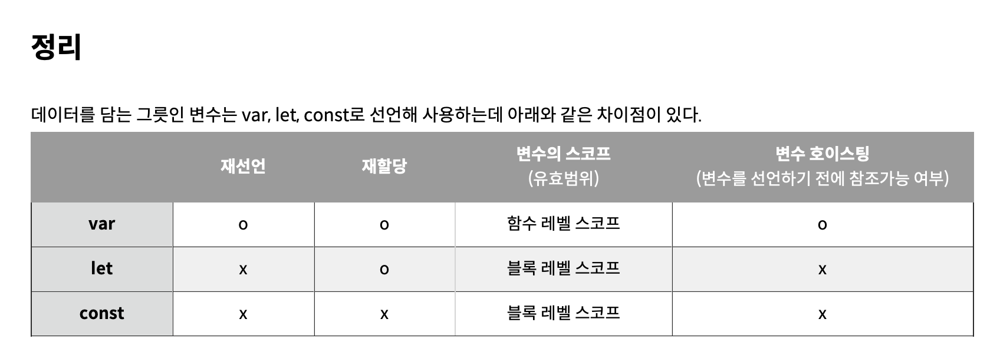

# TIL
# javascript 변수와 변수 선언

## 변수종류

- var
- let
- const
`
---

### 1. var

ES5에서 변수를 선언할 수 있는 유일한 방법으로 한 번 선언된 변수명에 데이터를 재할당, 동일한 변수명으로 재선언 가능함.

var 키워드 생략 o

호이스팅 o

함수 레벨 스코프 지원

### 2. let

한 번 선언된 변수명에 데이터 재할당은 가능, 하지만 동일한 변수명으로 재선언은 불가능함.(변수명이 동일해 발생하는 문제를 방지)

호이스팅 발생 x

블록 레벨 스코프 지원

### 3. const

constant 상수라는 뜻으로 변하지 않는 값 선언할 때 사용함.

변수를 선언하는 시점에 값을 할당하고 값을 재할당하거나 동일한 변수명으로 재선언 불가함

호이스팅 발생 x

블록 레벨 스코프 지원

#### \*\* 변수 호이스팅 : 인터프리터가 변수와 함수의 메모리 공간을 선언 전에 미리 할당하는 것을 의미.

#### \*\* 스코프 : 함수 레벨 스코프 / 블록 레벨 스코프

- 함수 레벨 스코프 : 함수 내에서 선언된 변수는 함수 내에서만 유효하며 함수 외부에서는 참조할 수 없음.
- 블록 레벨 스코프 : 모든 코드 블록내에서 선언된 변수는 코드 블록 내에서만 유효하며 코드 블록 외부에서는 참조할 수 없음.
